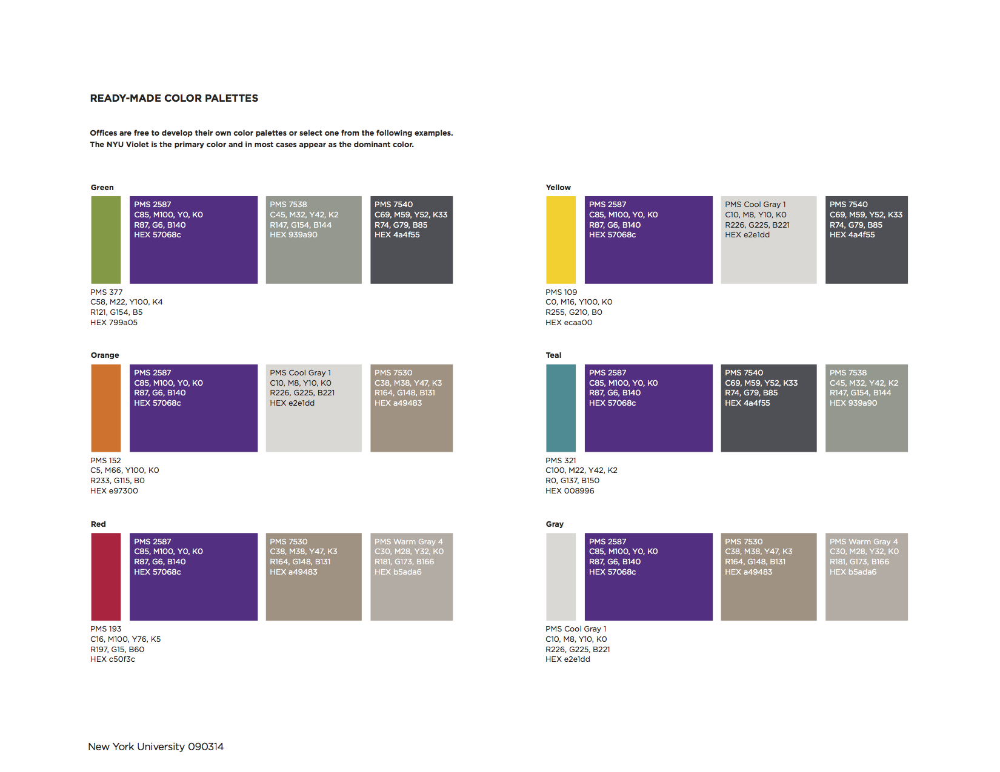

# palettesNYU

## Why do I exist?

This repository is meant to put a set of ready-made color palettes defined by [New York University](www.nyu.edu) into a format (GIMP Palette) that is easily usible for figure, poster and presentation design in [Inkscape](https://inkscape.org/en/) and [GIMP](https://www.gimp.org).

## Getting Started
To use this repository you may either download it as a [zip file](https://github.com/kdoelling1919/palettesNYU/archive/master.zip) or clone it using the command line to move into the desired directory and typing

```
git clone https://github.com/kdoelling1919/palettesNYU.git
```

### Inkscape
You can then add these palettes into the Inkscape palette directory. On Mac, this directory is often found in the ```~/.config``` folder but may have been moved elsewhere. If it is in the usual place, then you can use the following command in the command line to copy your new .gpl files over. Otherwise, you will need to replace the last path in the command with the correct directory. 

```
cp palettesNYU/*.gpl ~/.config/inkscape/palettes/
```

Once the files are in the inkscape palettes folder you should be able to find them in the palettes menu in Inkscape. Click on the black arrow at the bottom right of the inkscape window (right of the current color palette) and you should see the list of NYU color palettes.

### GIMP
GIMP will be able to import these palettes directly by going to Windows -> Dockable Dialogs -> Palettes

## What is in me?

The current list of color palettes are set by NYU Color Design (last updated 9/30/2014). You can find a pdf of these color palettes [here](https://www.nyu.edu/content/dam/nyu/advertisePublications/documents/standards/ReadyMadeColorPalettes_121214.pdf).

You can also see these color patterns below.

